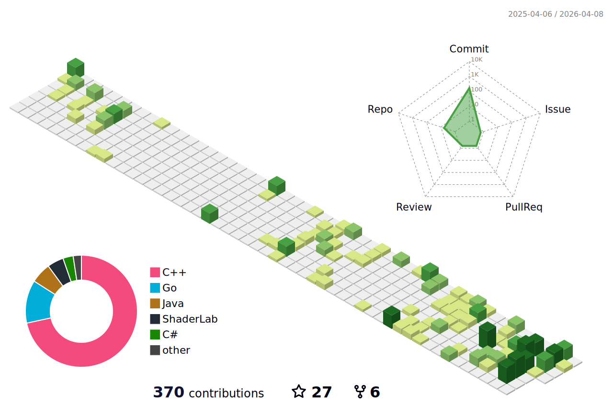

### Hey, I'm Matt Wheeler 

---

[](https://www.linkedin.com/in/matthew-thomas-wheeler/)
[](https://twitter.com/_wheelerMT)
[](https://www.instagram.com/wheelrrr/)


### Welcome to my GitHub!

I am a Senior Modelling & Simulation Engineer, working mainly with Fortran, C, and Matlab. In my spare time I love all-things systems programming, where I devote a lot of my time to learning and using Rust.

---

**Personal Stuff:**
- 👨🏻‍💻 I’ve created [BEC++](https://github.com/wheelerMT/BECpp) and [PyGPE](https://github.com/wheelerMT/pygpe): fast, adaptable Gross-Pitaevskii equation solvers built using C++, Python & CUDA.
- :wind_chime: I am also working on a [quantum vortex tracker](https://github.com/wheelerMT/quantumVortexTracker) built using deep learning!
- 🌱 I’m currently learning about [the Rust programming language](https://rust-lang.org).
- 💬 Ask me about my research!
- 📫 How to reach me: wheelerMT@proton.me.
- 😄 Pronouns: he/him.


📈 **My GitHub contributions for the past year:**


📊 **How I've been spending my last 30 days:**
<!--START_SECTION:waka-->

```txt
From: 06 July 2024 - To: 05 August 2024

Total Time: 2 hrs 51 mins

Markdown   1 hr 34 mins    >>>>>>>>>>>>>>-----------   55.07 %
Other      1 hr 10 mins    >>>>>>>>>>---------------   40.94 %
```

<!--END_SECTION:waka-->
