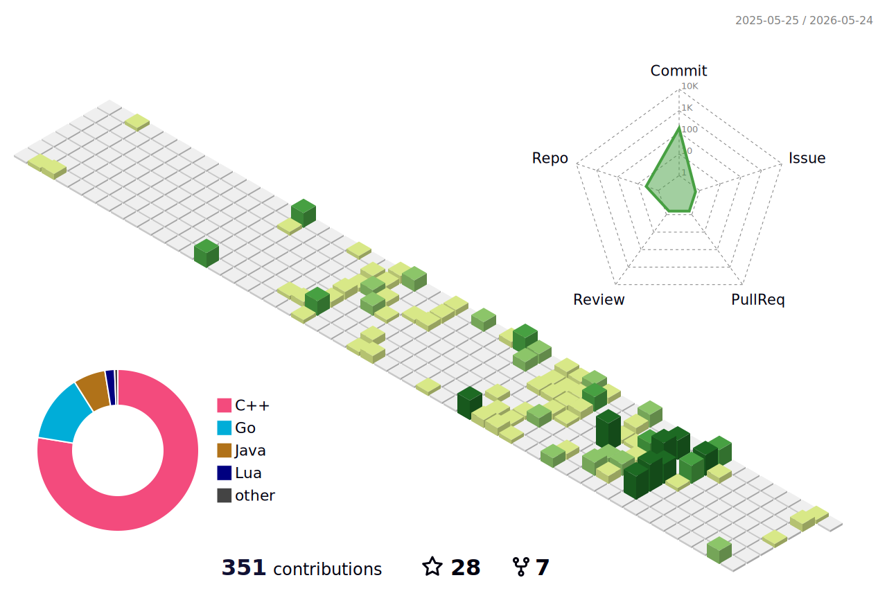

### Hey, I'm Matt Wheeler 

---

[](https://www.linkedin.com/in/matthew-thomas-wheeler/)


### Welcome to my GitHub!

I am a Senior Modelling & Simulation Engineer, working mainly with Fortran and C++. In my spare time I love all-things programming, where I devote a lot of my time to learning and using new tools.

---

**Personal Stuff:**
- 👨🏻‍💻 I am the creator of [PyGPE](https://github.com/wheelerMT/pygpe): a fast, adaptable Gross-Pitaevskii equation solver built using Python & CUDA.
- :wind_chime: I am also working on a [generic simulation & modelling platform](https://github.com/wheelerMT/GSMP) built using C++!
- 💬 Ask me about my research!
- 📫 How to reach me: wheelerMT@proton.me.
- 😄 Pronouns: he/him.

👨🏻‍💻 **Top languages:**

[](https://github.com/anuraghazra/github-readme-stats)

📈 **My GitHub contributions for the past year:**


📊 **Recent activity:**
<!--START_SECTION:waka-->

```txt
From: 14 March 2026 - To: 20 March 2026

Total Time: 10 hrs 1 min

Python           6 hrs 49 mins         >>>>>>>>>>>>>>>>>--------   68.14 %
C++              1 hr 20 mins          >>>----------------------   13.32 %
CMake            49 mins               >>-----------------------   08.20 %
CSV              22 mins               >------------------------   03.73 %
GitIgnore file   8 mins                -------------------------   01.49 %
```

<!--END_SECTION:waka-->
