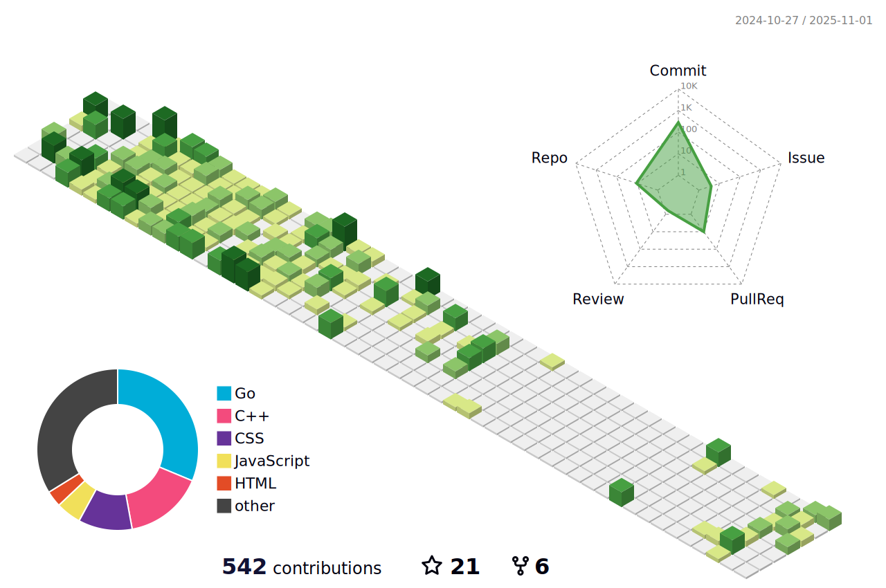

### Hey, I'm Matt Wheeler 

---

[](https://www.linkedin.com/in/matthew-thomas-wheeler/)


### Welcome to my GitHub!

I am a Senior Modelling & Simulation Engineer, working mainly with Fortran and C++. In my spare time I love all-things programming, where I devote a lot of my time to learning and using new tools.

---

**Personal Stuff:**
- 👨🏻‍💻 I am the creator of [PyGPE](https://github.com/wheelerMT/pygpe): a fast, adaptable Gross-Pitaevskii equation solver built using Python & CUDA.
- :wind_chime: I am also working on a [generic simulation & modelling platform](https://github.com/wheelerMT/GSMP) built using C++!
- 💬 Ask me about my research!
- 📫 How to reach me: wheelerMT@proton.me.
- 😄 Pronouns: he/him.


📈 **My GitHub contributions for the past year:**


📊 **Recent activity:**
<!--START_SECTION:waka-->

```txt
From: 02 March 2025 - To: 08 March 2025

Total Time: 9 hrs 19 mins

Rust         4 hrs 7 mins    >>>>>>>>>>>--------------   44.18 %
Swift        2 hrs 35 mins   >>>>>>>------------------   27.81 %
Python       1 hr 54 mins    >>>>>--------------------   20.49 %
Go           18 mins         >------------------------   03.30 %
Other        16 mins         >------------------------   02.96 %
```

<!--END_SECTION:waka-->
